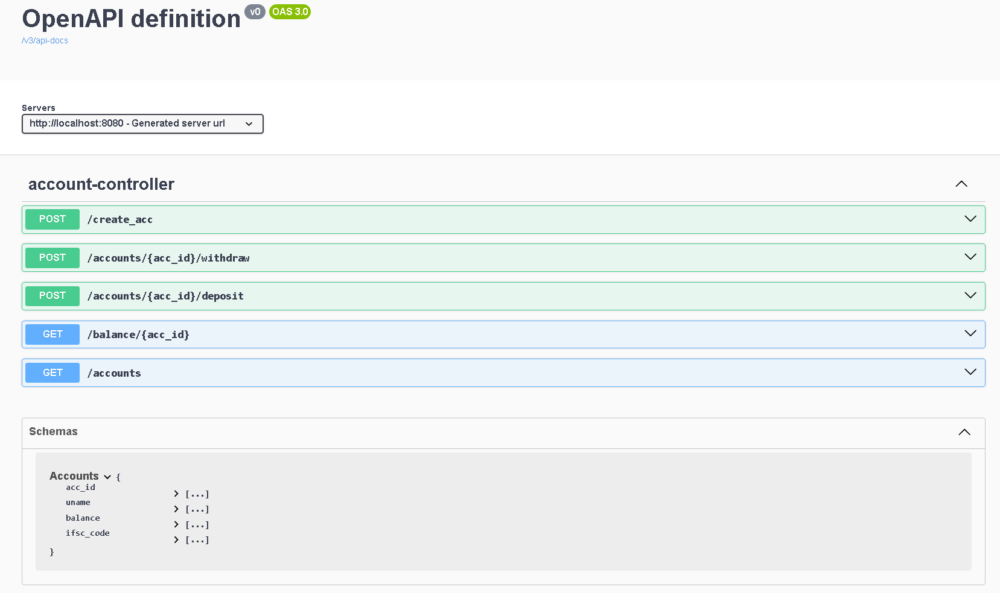

# Bank Management System

A full-stack web application for managing bank accounts, built with a modern personal-banking experience. Create an account, check your balance, deposit and withdraw funds — all from a sleek single-page dashboard where you only ever see **your own account**.

## ✨ Features

*   **Create New Account:** Open a new bank account with an initial deposit in seconds.
*   **My Account:** A private, personal dashboard — you only ever see and manage your own account.
*   **Check Balance:** See your current balance at a glance, any time.
*   **Deposit Funds:** Add funds to your account and watch your savings grow.
*   **Withdraw Funds:** Access your money quickly and easily, whenever you need it.
*   **RESTful API:** A well-defined API for interacting with the backend services.

## 🚀 Technologies Used

### Backend

*   **Java 21**
*   **Spring Boot 3.5.5**
    *   **Spring Data JPA:** For data persistence and interaction with the database.
    *   **Spring Web:** For building RESTful APIs.
*   **Maven:** For dependency management and building the project.
*   **MySQL:** As the relational database for storing account information.
*   **Lombok:** To reduce boilerplate code in model classes.

### Frontend

*   **Vanilla JavaScript single-page app** — no build step, no dependencies, served directly by Spring Boot from `src/main/resources/static`.
*   **HTML / CSS:** Semantic markup with a custom dark fintech design system (glass surfaces, gradient accents, fully responsive).
*   **Hash-based routing** with animated views, live form validation, toast notifications and offline detection with a retry option.

## API Endpoints

The backend exposes the following REST endpoints to manage bank accounts:

| HTTP Method | Endpoint                       | Description                    | Request Body      | Response Body                  |
| :---------- | :----------------------------- | :----------------------------- | :---------------- | :----------------------------- |
| `POST`      | `/create_acc`                  | Creates a new bank account.    | `Accounts` object | The newly created `Accounts` object |
| `GET`       | `/accounts`                    | Retrieves all bank accounts.   | -                 | A list of `Accounts` objects   |
| `GET`       | `/balance/{acc_id}`            | Retrieves the balance of a specific account. | -                 | The account balance (integer)  |
| `POST`      | `/accounts/{acc_id}/deposit`   | Deposits a specified amount into an account. | `Accounts` object with the deposit amount | A string with the updated balance |
| `POST`      | `/accounts/{acc_id}/withdraw`  | Withdraws a specified amount from an account. | `Accounts` object with the withdrawal amount | A string with the updated balance |

## API Documentation

This application includes Swagger UI for interactive API documentation.



Access it locally at: `http://localhost:8080/swagger-ui/index.html`

## 💻 How to Run

### Prerequisites

*   **Java 21** or later.
*   **Maven** installed and configured.
*   **MySQL** server running.
*   A modern web browser.

### Backend Setup

1.  **Clone the repository:**
    ```bash
    git clone <your-repository-url>
    cd bankmanagementsystem
    ```
2.  **Configure the database:**
    *   Open `src/main/resources/application.properties`.
    *   Update the `spring.datasource.url`, `spring.datasource.username`, and `spring.datasource.password` properties to match your MySQL database configuration.
3.  **Build and run the application:**
    ```bash
    mvn spring-boot:run
    ```
    The server starts at `http://localhost:8080`.

### Using the App

1.  Open `http://localhost:8080` in your browser — the frontend is served by Spring Boot itself, so there is **no separate frontend setup**.
2.  Click **Open an Account** to get your account number, then use it to check your balance, deposit and withdraw. You only ever see your own account.
3.  Interactive API docs (Swagger UI) are available at `http://localhost:8080/swagger-ui/index.html`.
