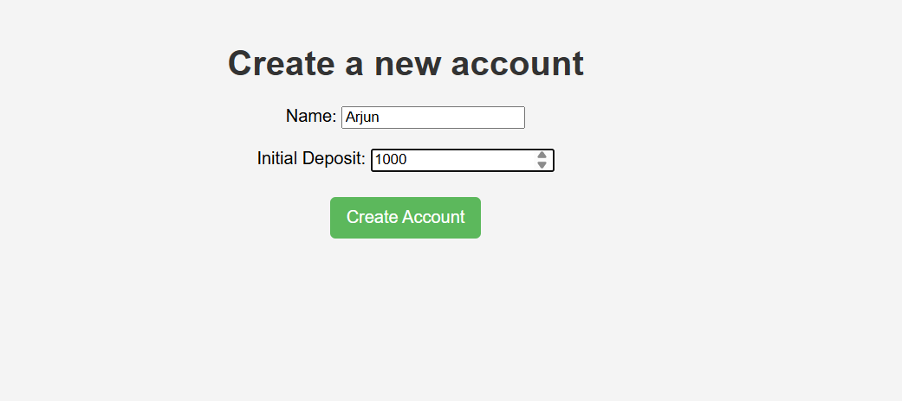
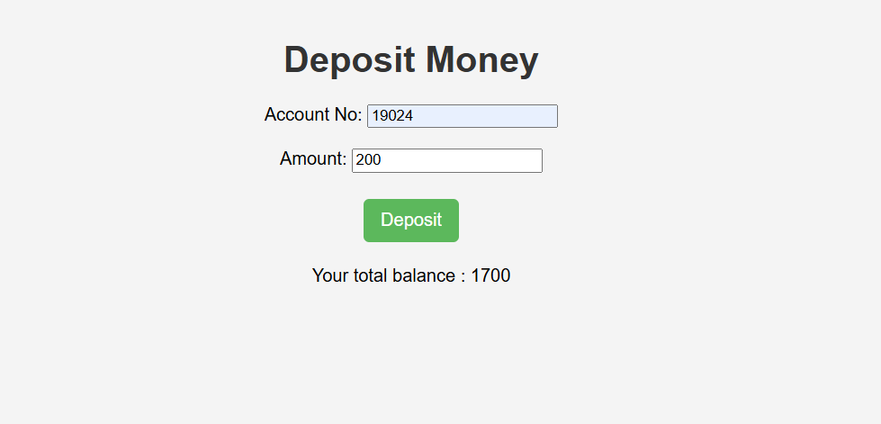

# Bank Management System

This is a full-stack web application that provides a simple and intuitive interface for managing bank accounts. It allows users to create new accounts, check balances, deposit and withdraw funds, and view all accounts.

## ✨ Features

*   **Create New Account:** Easily create a new bank account with an initial deposit.
*   **Check Balance:** Quickly check the current balance of any account.
*   **Deposit Funds:** Add funds to an existing account.
*   **Withdraw Funds:** Withdraw funds from an existing account.
*   **View All Accounts:** See a list of all bank accounts in the system.
*   **RESTful API:** A well-defined API for interacting with the backend services.

## 🚀 Technologies Used

### Backend

*   **Java 21**
*   **Spring Boot 3.5.5**
    *   **Spring Data JPA:** For data persistence and interaction with the database.
    *   **Spring Web:** For building RESTful APIs.
*   **Maven:** For dependency management and building the project.
*   **MySQL:** As the relational database for storing account information.
*   **Lombok:** To reduce boilerplate code in model classes.

### Frontend

*   **HTML:** For the structure of the web pages.
*   **CSS:** For styling the user interface.
*   **JavaScript:** For client-side logic and interacting with the backend API.

## API Endpoints

The backend exposes the following REST endpoints to manage bank accounts:

| HTTP Method | Endpoint                       | Description                    | Request Body      | Response Body                  |
| :---------- | :----------------------------- | :----------------------------- | :---------------- | :----------------------------- |
| `POST`      | `/create_acc`                  | Creates a new bank account.    | `Accounts` object | The newly created `Accounts` object |
| `GET`       | `/accounts`                    | Retrieves all bank accounts.   | -                 | A list of `Accounts` objects   |
| `GET`       | `/balance/{acc_id}`            | Retrieves the balance of a specific account. | -                 | The account balance (integer)  |
| `POST`      | `/accounts/{acc_id}/deposit`   | Deposits a specified amount into an account. | `Accounts` object with the deposit amount | A string with the updated balance |
| `POST`      | `/accounts/{acc_id}/withdraw`  | Withdraws a specified amount from an account. | `Accounts` object with the withdrawal amount | A string with the updated balance |

## 💻 How to Run

### Prerequisites

*   **Java 21** or later.
*   **Maven** installed and configured.
*   **MySQL** server running.
*   A modern web browser.

### Backend Setup

1.  **Clone the repository:**
    ```bash
    git clone <your-repository-url>
    cd bankmanagementsystem
    ```
2.  **Configure the database:**
    *   Open `src/main/resources/application.properties`.
    *   Update the `spring.datasource.url`, `spring.datasource.username`, and `spring.datasource.password` properties to match your MySQL database configuration.
3.  **Build and run the application:**
    ```bash
    mvn spring-boot:run
    ```
    The backend server will start on `http://localhost:8080`.

### Frontend Setup

1.  Navigate to the `bankmanagementsystem frontend` directory.
2.  Open the `index.html` file in your web browser.

## Project Screenshots

### Homepage


### Account creation


### Balance check


### Deposit


### Withdraw

